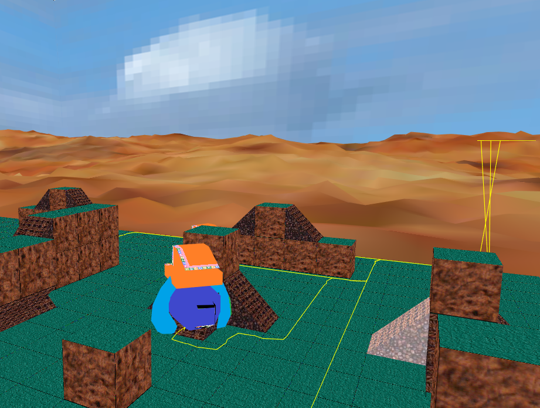

# TemperFine

## About
--------

TemperFine is a 3D voxel-based multiplayer real-time strategy game which takes place on an alien world.

Written in C++ with raw OpenGL 4.0.

## Status
---------
### SUPERSEDED

Work on other game projects (such as [agow] (https://github.com/GuMiner/agow), which does not require detailed art assets) 
has caused this project to be put on indefinite hold for the time being.

## Documentation
----------------

* [Contributing to TemperFine] (./docs/Contributing.md)
* [TemperFine Structure] (./docs/Structure.md)
* [OpenGL Concepts] (./docs/OpenGL4.md) 
* [Game Design] (./docs/GameDesign.md)
* [Active Tasks] (./docs/ActiveTasks.md)

## System Requirements
----------------------

* Intel Atom Z3735F
* OpenGL 4.0.0 compatible GPU
* 2 GB RAM

## Dependencies
---------------
Licenses for dependencies are within the *licenses* folder.

* [SFML 2.3.2] (http://www.sfml-dev.org/index.php)
* [SFGUI 0.3] (http://sfgui.sfml-dev.de/p/)
* [GLEW 1.12] (http://glew.sourceforge.net/)
* [STB latest] (https://github.com/nothings/stb)
* [MESA 11.1.1] (http://www.mesa3d.org)
