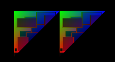

# OpenGL Concepts
## General
----------
This document isn't intended to be a complete walkthrough of OpenGL (there are large books for that) or to explain OpenGL basics -- rather, this document covers the OpenGL used within TemperFine.

#### Minimal Basics
-------------------

OpenGL draws a series of provided **vertex buffer object** data on screen, using **shader programs (shaders)** to compute what to draw from the data.

Because that one sentence boils down the core of OpenGL, let's start with **shaders**.

#### Shaders
------------
**Shaders** come in three main flavors -- vertex, geometry, and fragment. Every shader program needs a vertex and fragment shader -- geometry shaders are optional.

Vertex shaders take in an individual **vertex** from a **vertex buffer object**, and perform geometrical transformations to the position of the vertex's point is visible *and* set the color of the vertex's point.

Fragment shaders take in an interpolated combination of all three vertexes (if drawing triangles) and set the color of the on-screen point the fragment represents. Texture mapping is usually applied at this stage, as the fragment shader will use the UV coordinates provided from the **vertex** to lookup the color that coordinate points to on the **texture**.

Geometry shaders intercept the results of vertex shaders and can either add more coordinates (transforming points into triangles) or less (transforming triangles into points). For the most part, you wont't need to interact with this shader type.

**TemperFine** includes a *ShaderManager* that simplifies creating **shader programs**. When provided a filename, the *ShaderManager* will read, compile and return a single **GLuint** representing the program ID. 

#### Data Transfer
------------------
Data is sent to OpenGL either per-vertex (as part of the **vertex buffer object**), or per-draw (as a **uniform**). **uniform** data usually includes the model&view matrix, projection matrix, and textures.
**TemperFine** includes a *ImageManager* that given an image name, will load the image into a 8-bit RGBA texture and return the **GLuint** texture ID.

Despite the name, OpenGL vertexes can contain a lot more than vertex data. Vertex data usually includes the vertex position, color, and uv coordinates. **TemperFine** also includes a *universalVertices* struct that simplifies sending vertex data to OpenGL. 

#### Getting Started
--------------------
Finally, now that we have enough background, here's a simple series of code snippets for drawing a colored, textured triangle.

**TextureDraw.h**
```cpp
#include <GL\glew.h>
#include "ImageManager.h" // Simplifies texture loading
#include "ShaderManager.h" // Simplifies shader loading
#include "Vertex.h" // Simplifies VBO / management.
#include "vmath.hpp" // Matrix and vector math that works with OpenGL
...
private:
    // The shader program to use, loaded with ShaderManager.cpp
    GLuint shaderProgramId;
    
    // Locations of uniforms within the shader program.
    GLuint mvMatrixLocation;
    GLuint projMatrixLocation;    
    GLuint textureLocation;
    
    // ID of the texture
    GLuint textureId;
    universalVertices testVertices;
    
    // Vertex array object (VAO) and buffer objects (VBO)
    // We send in vertex data as individual buffers (and not interlaced),
    //  so we need a separate buffer ID for each.
    GLuint vao;
    GLuint positionBuffer;
    GLuint colorBuffer;
    GLuint uvBuffer;
    
public:
    ...
    bool Initialize(ShaderManager& shaderManager, ImageManager& imageManager);
    void Render(vmath::mat4& projectionMatrix);
    ~TextureDraw();
    
```

**TextureDraw.cpp**
```cpp
bool TextureDraw::Initialize(ShaderManager& shaderManager, ImageManager& imageManager)
{
    // Compile our shader program.
	if (!shaderManager.CreateShaderProgram("textureShader", &shaderProgramId))
	{
	    // Compilation failed.
		return false;
	}

    // Read locations of uniforms from the program.
    mvMatrixLocation = glGetUniformLocation(shaderProgramId, "mvMatrix");
    projMatrixLocation = glGetUniformLocation(shaderProgramId, "projMatix");
    textureLocation = glGetUniformLocation(shaderProgramId, "texureSampler");
    
    // Load an image as a texture
    textureId = imageManager.AddImage("images/texture.png");
    if (textureId == 0)
    {
        // Loading failed.
        return false;
    }
    
    // Generate the VAO/VBO
	glGenVertexArrays(1, &vao);
	glBindVertexArray(vao);

    glGenBuffers(1, &positionBuffer);
	glGenBuffers(1, &colorBuffer);
	glGenBuffers(1, &uvBuffer);
    
    // Add some data to the universal vertices and send to OpenGL.
    
	testVertices.positions.push_back(vmath::vec3(0, 0, 0));
	testVertices.positions.push_back(vmath::vec3(0, 1, 0));
	testVertices.positions.push_back(vmath::vec3(1, 1, 0));

	testVertices.colors.push_back(vmath::vec3(1, 0, 0));
	testVertices.colors.push_back(vmath::vec3(0, 1, 0));
	testVertices.colors.push_back(vmath::vec3(0, 0, 1));

    testVertices.uvs.push_back(vmath::vec2(0, 0));
    testVertices.uvs.push_back(vmath::vec2(1, 0));
    testVertices.uvs.push_back(vmath::vec2(1, 1));

    // Note that the send-to-OpenGL part can only be done when a VAO is bound.
	testVertices.TransferPositionToOpenGl(positionBuffer);
	testVertices.TransferColorToOpenGl(colorBuffer);
	testVertices.TransferUvsToOpenGl(uvBuffer);    

    // Everything succeeded	
    return true;
}

void TextureDraw::Render(vmath::mat4& projectionMatrix)
{
    // Use our shader program for this render
    glUseProgram(shaderProgramId);
    
    // Bind our texture to Unit 0 and set the texture uniform to that value.
    // Note we can only use Unit 0 to Unit 7 on low-end hardware.
    GLuint unit = 0;
    glActiveTexture(GL_TEXTURE0 + unit);
    glBindTexture(GL_TEXTURE_2D, textureId);
    glUniform1i(textureLocation, unit);
    
    // Send in the projection matrix and an empty model&view matrix.
    glUniformMatrix4fv(projMatrixLocation, 1, GL_FALSE, projectionMatrix);
    glUniformMatrix4fv(mvMatrixLocation, 1, GL_FALSE, vmath::mat4::identity());
    
    // Bind our VAO.
    glBindVertexArray(vao);
    
    // Because we've already sent in our vertex data beforehand, finally draw.
    glDrawArrays(GL_TRIANGLES, 0, testVertices.positions.size());
}

TextureDraw::~TextureDraw()
{
    // Delete the VAO/VBO
    glDeleteVertexArrays(1, &vao);
	glDeleteBuffers(1, &positionBuffer);
	glDeleteBuffers(1, &colorBuffer);
	glDeleteBuffers(1, &uvBuffer);

    // Shader & texture deletion is taken care of by the *Manager classes.
}
```

**textureShader.vs**
```c
#version 400

// Declare we're importing a VBO with position, color, and uvCoordinate.
// The locations of these should match those used in Vertex.cpp.
layout (location = 0) in vec3 position;
layout (location = 1) in vec3 color;
layout (location = 3) in vec2 uvCoordinate;

// Declare we're sending a color and UV coordinate for this point
//  to the fragment shader.
out VS_OUT
{
    vec4 color;
    vec2 uvCoord;
} vs_out;

// Import a 4x4 model&view matrix and 4x4 projection matrix.
uniform mat4 mvMatrix;
uniform mat4 projMatrix;

void main(void)
{
    // Pass-through the color and UV coordinate.
    vs_out.color = vec4(color.x, color.y, color.z, 1);
    vs_out.uvCoord = uvCoordinate;
    
    // Matrix-multiply our projection, model&view, and position to
    //  find the OpenGL view position of this vertex.
    gl_Position = projMatrix * mvMatrix * vec4(position, 1);
}
```

**textureShader.fs**
```c
#version 400 core

// Import a texture.
uniform sampler2D textureSampler;

// Send out a color (this is a pixel after all)
out vec4 color;

// Input an interpoloated color and interpolated UV coordinate.
in VS_OUT
{
    vec4 color;
    vec2 uvCoord;
} fs_in;

void main(void)
{
    // Multiplies the interpolated color of the vertex by the color
    //  that we lookup from within the texture.
    // Note that because the color is a *vector*,
    //  this is a per-index multiplication.
    color = fs_in.color * texture2D(textureSampler, fs_in.uvCoord);
}
```

This code will produce a triangle looking something like this:


#####Key Points
* OpenGL uses a lot of state -- the **vertex buffer object** is setup, the **texture** is setup, both are bound to the active **vertex array object**, after which the single *glDrawArrays(...)* command draws the triangles.
* OpenGL 4.0 allows us to specify the index positions of the vertex data (in the vertex shader), but does not allow us to specify the bind locations of **uniforms**.  This is why we have to call *glGetUniformLocation* in the *::Initialize(...)* call and use that location for binding when rendering.
* Objects are initialized in an *::Initialize(...)* method (because there is an OpenGL context there), and deinitialized in the *::~* destructor.


## Multithreading
--------------------------
Because **TemperFine** uses a separate physics thread and graphics thread, OpenGL updates cannot be performed at the same time as physics updates. 

The recommended work around is write to a toggle flag in the physics thread, and check for the toggle flag in the graphics thread -- if the toggle flag is set, update the graphics from the updated physics.

To ensure consistency of the data being sent to OpenGL, you can use SFML Mutexes (sf::Mutex in SFML\System.hpp), and lock the mutex during the physics update and during the graphics update. However, using mutexes is not requird.

#### Glossary
-------------
* GLuint -- OpenGL's name for an unsigned int.
* shader program (shader) -- A program for transforming vertex data onto on-screen drawing.
* texture -- An image that has been loaded into OpenGL for rendering / array data lookup.
* uniform -- The name for a per-draw data sent to OpenGL.
* vertex -- The name for per-point data sent to OpenGL.
* vertex array object -- Needed context for drawing and sending VBO data to OpenGL.
* vertex buffer object -- Holder of vertex data being sent to OpenGL.